<!--
  ┌────────────────────────────────────────────────────────────────┐
  │  ONE-PASS SETUP — replace these, then delete this comment block │
  │  • Commit banner.svg to the ROOT of your profile repo           │
  │    (repo name must equal your username, e.g. bry4n/bry4n)       │
  │  • Find & replace  bry4n  with your real GitHub username        │
  │  • Fill every  «REPO_LINK»  and  «LIVE_LINK»  below             │
  │  • Replace «PORTFOLIO_URL» / «LINKEDIN_URL» / «X_URL»           │
  └────────────────────────────────────────────────────────────────┘
-->

<a href="«PORTFOLIO_URL»">
  
</a>

<br/>


I build full-stack web applications end to end — from Figma wireframe to deployed, maintained product — and bring a designer's eye to every layer. Currently finishing a **B.Sc. in Software Engineering** at The ICT University, with hands-on experience across freelance delivery and corporate IT at **CAMTEL**, Cameroon's national telecom.

What sets me apart: I don't hand off the design. **Engineering, UI/UX, and brand all ship from the same person** — so the interface, the code, and the visual identity actually agree with each other.

<br/>

### Selected Work

<table>
  <tr>
    <td width="50%" valign="top">
      <h4>Casey Brown Services</h4>
      <p>Full, responsive web presence for an HSE consulting firm — built for cross-device performance and to convert visitor inquiries. Owned architecture, build, and ongoing maintenance.</p>
      <p>
        <a href="https://caseybrownservices.com"><b>Live&nbsp;↗</b></a>
        &nbsp;·&nbsp;
        <a href="«REPO_LINK»">Code</a>
      </p>
    </td>
    <td width="50%" valign="top">
      <h4>«PROJECT_TWO»</h4>
      <p>One sharp sentence on what it does and the outcome it drove. Lead with the result, not the stack — recruiters skim, clients buy outcomes.</p>
      <p>
        <a href="«LIVE_LINK»"><b>Live&nbsp;↗</b></a>
        &nbsp;·&nbsp;
        <a href="«REPO_LINK»">Code</a>
      </p>
    </td>
  </tr>
  <tr>
    <td width="50%" valign="top">
      <h4>«PROJECT_THREE»</h4>
      <p>Pick your strongest React build. If a project has no public repo or live link, leave it out — an unlinked "project" reads as a gap, not a credential.</p>
      <p>
        <a href="«LIVE_LINK»"><b>Live&nbsp;↗</b></a>
        &nbsp;·&nbsp;
        <a href="«REPO_LINK»">Code</a>
      </p>
    </td>
    <td width="50%" valign="top">
      <h4>Brand & Visual Identity</h4>
      <p>Print-ready identities for local businesses — logos, banners, flyers, stickers. Built in Adobe Suite and Figma with a consistent system per client.</p>
      <p>
        <a href="«PORTFOLIO_URL»"><b>Portfolio&nbsp;↗</b></a>
      </p>
    </td>
  </tr>
</table>

<br/>

### Tech

```
Frontend     React.js · JavaScript · HTML5 · CSS3 · Tailwind
Backend      Node.js · PHP
Mobile       Android Studio (Kotlin)
Data         MySQL · SQLite
Languages    JavaScript · Python · Java · Kotlin
Design       Figma · Adobe Suite · Canva
Workflow     Git / GitHub · Linux · Agile
```

<br/>

### Experience

**IT Support & Design Intern** — CAMTEL · *Mar – May 2025*
Hardware/software troubleshooting, network maintenance, and system configuration. Designed official corporate logos, event posters, and internal banners. Ran staff training on productivity tools and cybersecurity practice.

**Freelance Web Developer & Designer** — Remote · *2024 – Present*
Ship responsive websites and full brand asset sets for clients end to end — translating requirements into clean builds and cohesive visual identities, then maintaining the infrastructure.

<br/>

### Beyond Code

Engineering is one of three things I do well — I also design brand systems and edit cinematic video. That range is the point: I can take a product from blank canvas to a coherent, shippable whole without a handoff losing the intent.

<br/>

### Connect

<p>
  <a href="mailto:bry4n.4yuk@gmail.com"><b>Email</b></a> &nbsp;·&nbsp;
  <a href="«LINKEDIN_URL»">LinkedIn</a> &nbsp;·&nbsp;
  <a href="«PORTFOLIO_URL»">Portfolio</a> &nbsp;·&nbsp;
  <a href="«X_URL»">X</a>
</p>

<sub>Yaoundé, Cameroon · English & French (full professional) · Open to remote roles and freelance</sub>

<!--
  OPTIONAL — a single, palette-matched stats card. Uncomment if you want it.
  Nothing else: no streak card, no trophy wall, no contribution-snake. One card or none.

  
-->
